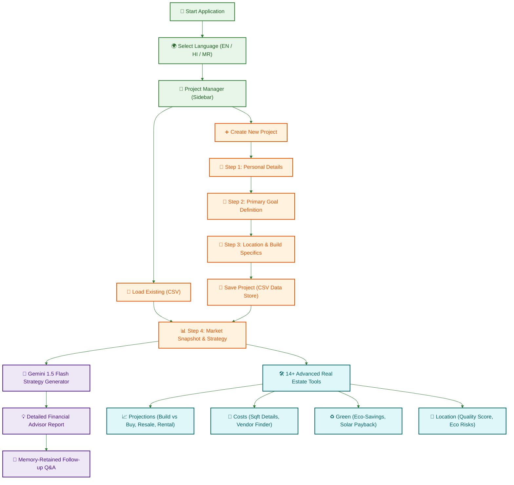

# 🏠 AI Real Estate Advisor — Central India Hackathon 2.0

### *CIH 2.0 Final Round Submission — Real Estate Planning Dashboard*

---

<div align="center">
  
  
  
</div>

---

> 🏆 **Central India Hackathon 2.0 Finalist Project**  
> *Developed during the intense 36-hour **Round 2 (Final Round)** of CIH 2.0 (23–24 June 2025) organized by **Suryodaya College of Engineering & Technology, Nagpur**.*

---

## 🎯 Platform Objectives

The **AI Real Estate Advisor** is a multilingual, data-driven planning ecosystem built to simplify Indian real estate investments. By pairing the rapid reasoning capabilities of **Google Gemini 1.5 Flash** with custom unit-economic algorithms, the application assists users in navigating complex decisions—such as whether to build a multi-unit property versus buying a single flat, estimating future rental yield, forecasting resale values, and assessing ecological risks.

---

## ⚡ System Architecture & Execution Pipeline

The application operates on a state-based multi-step form workflow synchronized with local CSV persistence and live AI analysis tools:



---

## ⚡ Core Feature Modules

### 🌐 1. Multilingual Support
* Full language localization for **English, Hindi (हिन्दी), and Marathi (मराठी)** to maximize accessibility for diverse demographics across central India.

### 🧠 2. Gemini 1.5 Flash Strategy Engine
* **Initial Planning Report:** Synthesizes user income, goals, budgets, and localities into structured financial recommendations.
* **Follow-up Advisor Q&A:** A state-retaining chat feature allowing users to ask natural language questions about interest rate hikes, regulatory rules, or local developer credentials.

### 📊 3. 14+ Micro-Analysis & Simulation Tools

#### **📈 Projections & Pro-Formas**
* **Build vs. Buy Analyzer:** Unit economic calculator analyzing the profitability of buying a ready-made flat versus constructing a multi-unit property on land, factoring in the target Floor Space Index (FSI).
* **Future Resale Predictor:** Generates a 10-year compound growth projection matching local market rates.
* **Hyper-Local Rent Forecaster:** Forecasts commercial and residential rental potential based on proximity variables (e.g., Main Road vs. Interior).
* **Investment Payback Calculator:** Calculates capital recovery windows matching localized maintenance expense ratios.

#### **🧱 Structural Cost Estimations**
* **Detailed sq.ft. Costing:** Displays granular itemized cost tables (structural foundations, Vitrified flooring, plumbing, painting) matching the user's budget.
* **Material Price Index:** Establishes commercial material prices (cement, steel, sand, bricks) across municipal zones.
* **Vendor Suggestion Hub:** Recommends highly-rated local builders, electricians, plumbers, and solar contractors.

#### **🏞️ Environmental & Location Intelligence**
* **Location Quality Score:** Renders an interactive score (0-100) analyzing proximity preferences and local pollution/crime concerns.
* **Alternative Localities:** Discovers comparable nearby neighborhoods matching the user's target square footage.
* **Environmental Eco-Risk Scan:** Evaluates potential flood risks and ecological sensitivities.

#### **🏦 Home Loans & Subsidies**
* **Subsidy Eligibility Guide:** Integrates logic for government initiatives such as **PMAY** (Pradhan Mantri Awas Yojana) based on annual household income and category.
* **Tax Benefit Guide:** Explains deductions under Sections 24(b) and 80C.

---

## 🚀 Setup & Execution Guide

The application runs in standard Python environments (local, Codespaces, or cloud containers):

### **Prerequisites**
* **Python 3.9** or higher installed.
* **Google Gemini API Key** (Obtain a key for free at [Google AI Studio](https://aistudio.google.com/)).

---

### **1. Clone the Directory**
Clone the repository to your workspace:
```bash
git clone https://github.com/Advait251206/Code_Warriors_CIH_2.0.git
cd Code_Warriors_CIH_2.0
```

### **2. Install Dependencies**
Install verified packages from the requirements registry:
```bash
pip install -r requirements.txt
```

### **3. Configure API Credentials**
To prevent exposed credentials, the script loads your key securely in priority order:
1. **Environment Variable:** Set `GOOGLE_API_KEY` on your OS.
2. **Local Dotenv File:** Create a `.env` file in the root directory:
   ```env
   GOOGLE_API_KEY=your_gemini_api_key_here
   ```
3. **Interactive UI Input:** If no key is configured, a secure password input field will display in the Streamlit sidebar.

### **4. Launch the Streamlit Advisor**
Execute the script to boot the web client:
```bash
streamlit run app.py
```

---

## 📁 Repository Organization

```
├── .gitignore        # Ignores pycache, .env credentials, and local project save states
├── README.md         # Dynamic CIH 2.0 project documentation with colored Mermaid map
├── app.py            # Streamlit client script & modular computational algorithms
├── requirements.txt  # Project library dependencies
└── projects/         # Directory containing CSV-based project data (automatically ignored)
```

---

<br>
<p align="center">
  <i>Simulated and optimized with precision for the Central India Hackathon 2.0 Final Round 🏠.</i>
</p>
